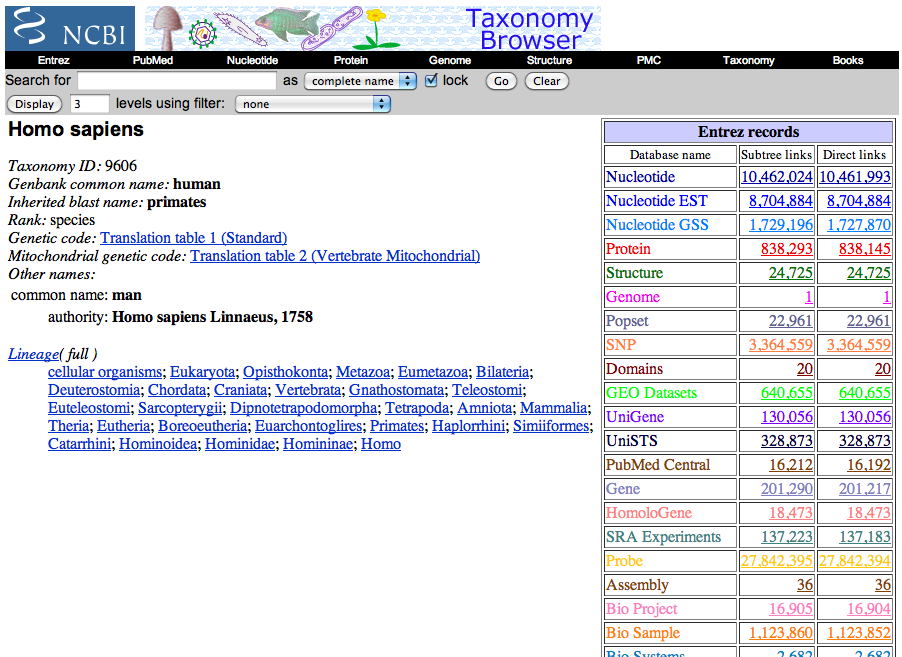
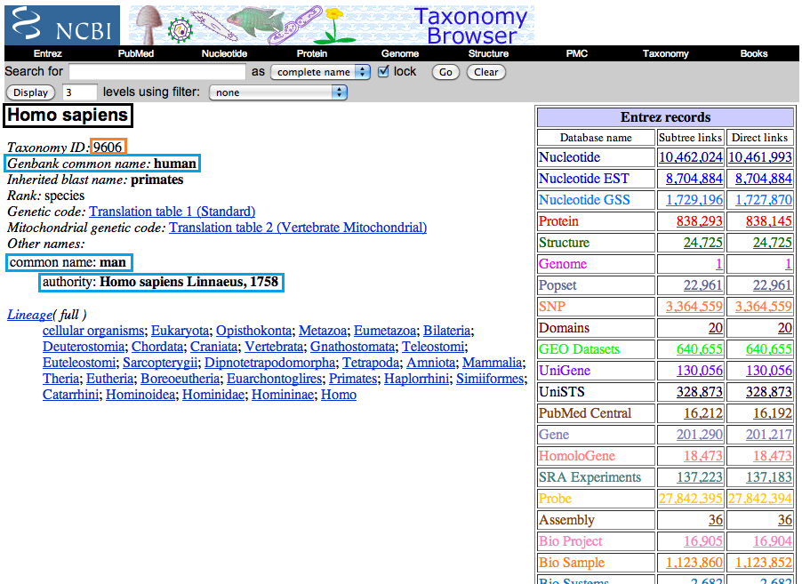
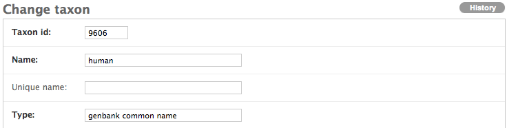
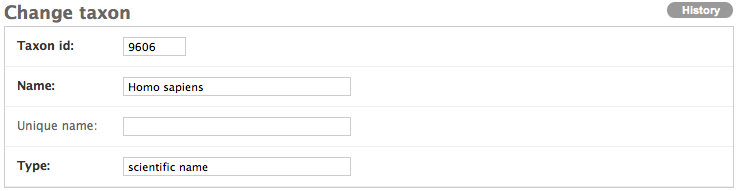
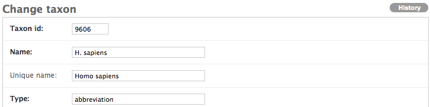
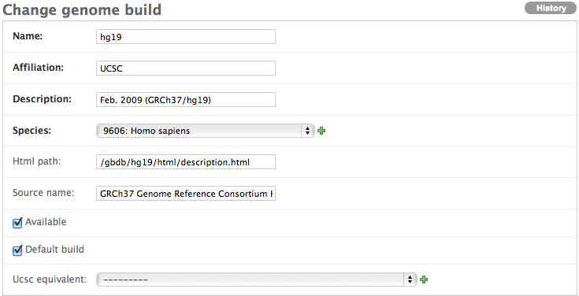
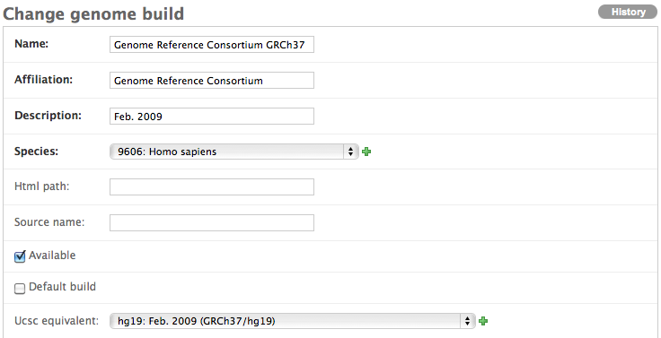

.. _add_new_genomebuild:

Adding a Genome Build into Refinery for Visualizations
=======================================================

Adding a genome build to refinery is a two-step process: first, you need to add in the taxon information for your organism, and then you create the associated genome build. These are both done through the admin interface.

Before logging into the admin interface however, we need to the taxonomy information for our organism, so go to NCBI's taxonomy browser (http://www.ncbi.nlm.nih.gov/taxonomy) and search for your organism.  You should eventually end up on a page that looks something like this:

Keep the page open and go to the refinery admin interface.  After logging in, navigate to the *Annotation Server* and click on *Taxons*, then click on *Add taxon*. From there, you will be brought to a form with four fields:

* Taxon id: NCBI taxon ID
* Name: the name of the organism
* Unique name: the scientific name of the organism if the name provided in the above field is not unique across all possible names (e.g. *C. elegans* can refer to multiple species)
* Type: type of name (e.g. scientific name, an abbreviation, the common name, etc.)

The NCBI taxonomy page in your browser will help you fill in all of the values.  See the picture below to know what information on the page goes where. Please note that you need to create a new entry for every name that you use. So in our example below, if you wished to put all of these names in the database, you would create an entry for *Homo sapiens*, human, man, and Homo sapiens Linnaeus, 1758 in addition to any other names you might wish to create (e.g. *H. sapiens*).

In the above image, the important pieces of information have been highlighted in colored boxes.  Below are two examples.

Because the scientific name has no type associated with it, please annotate the the *type* field with "scientific name." This is the official type designated by NCBI.

Even though *H. sapiens* is not on the taxonomy page, because many people use a species' abbreviated name when annotating their data, fill out the form accordingly.

Now that the taxon information has been filled in for your organism, you can input the information for the genome build you'd like to support.  Click *Annotation server* again in the admin interface and this time click *Genome builds*.  Fill in the fields accordingly to the best of your knowledge, making sure to have the species point to the taxon that uses the full scientific name.  Below are two examples.  Please make sure only one genome build for each organism is selected as the default.

Please note that while it is not required that you fill in a UCSC equivalent for any non-UCSC genome builds provided, we are currently considering the UCSC genome builds to be the standard, so we'd prefer that it exist.