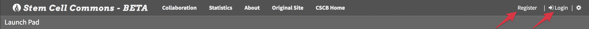
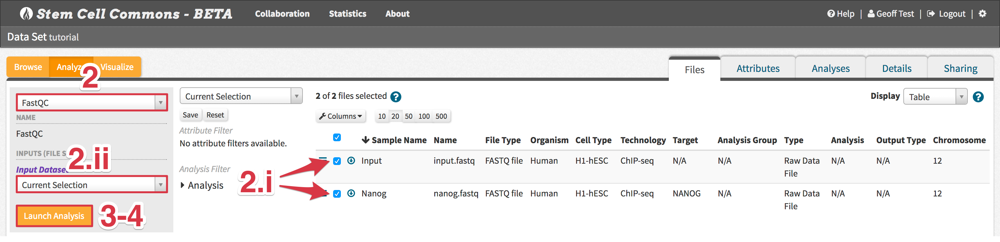

# Refinery Tutorial 

Refinery is a data management, analysis, and visualization platform designed to support analysts in managing common tasks in analysis and interpretation of biomedical data. 

In this tutorial you will learn how to load data into Refinery, how to analyze it using workflows, and how to view analysis results using built-in visualization tools. Additionally, this tutorial demonstrates how to work with the data repository, how to use features that are supporting reproducible research, and how to use the collaboration tools of Refinery.

__Preparation__

To follow the steps of this tutorial, you will need a data set consisting of data files and a metadata file that is referencing your files.

> __Tutorial Data Set__
>
> This tutorial can be followed using the __Tutorial Data Set__, which consists of sample ChIP-seq data and their associated metadata file. Download the __Tutorial Data Set__ files here:
> - [control (FASTQ)][input.fastq]
> - [experimental (FASTQ)][nanog.fastq]
> - [metadata (TSV)][tutorial.tsv]
>
> Note the expanded instructions associated with some steps of the tutorial that pertain specifically to the __Tutorial Data Set__. Also, skip section __1. Creating a Metadata File__ since a metadata file is already provided within the __Tutorial Data Set__.

## 0. Accessing Refinery
- Go to the [Refinery Launch Pad][scc-home] and either
  - *create a new account*:
    1. Click *__Register__* at the top right of the navigation bar (top of page)
    2. Provide the required details and then click the *__Register__* button below
    3. Wait to receive an account activation e-mail at the address provided during registration
  - *log in to an account*:
    1. Click *__Login__* at the top right of the navigation bar
    2. Enter the *__Username or E-mail__* and *__Password__* provided during registration and click the *__Login__* button below

## 1. Creating a Metadata File
- Create a metadata table within a delimited (e.g. tab-delimited) text file in which rows correspond to data files to be uploaded and columns provide metadata attributes (a template metadata file can be found [here][refinery-sample-metadata.tsv]). The naming and ordering of the columns can be arbitrary, but the metadata table 
  - *must* have 3 columns to describe *(1) sample identifiers, (2) filenames, (3) species identifiers*
    - Tip 1: Assigning these attributes to the first 3 columns of the table (same order as listed above) will slightly simplify the data set upload
    - Tip 2: *Filenames* should refer to data files either located on your local computer (do *not* include the file path) or on a web server accessible via public URLs (provide the full URL)
  - can contain as many additional columns as desired
  - *must* provide column names as its first row
  - *must* use column names that are unique, do *not* contain special characters, and are *not* the same as the following internally reserved metadata attribute names: *Assay_uuid, Django_ct, Django_id, File_uuid, Genome_build, Id, Is_annotation, Name, Species, Study_uuid, Type*
    - Tip: Descriptive yet concise names will be most effective

> __Tutorial Data Set:__ skip this step since the tab-delimited `tutorial.tsv` metadata file is already provided

## 2. Uploading a Data Set
1. From the *__Launch Pad__* (Refinery homepage), Click *__Upload__* from the *__Data Sets__* panel

2. First choose delimiter used in the metadata file and then upload the file
    > __Tutorial Data Set:__ upload the tab-delimited `tutorial.tsv` metadata file
3. Check metadata *__Preview__* for accuracy (note: only first 5 samples are displayed)
4. Review *__Configure Metadata Import__* and make changes as needed
    > __Tutorial Data Set:__ no changes are needed
5. Click *__Add files…__* button under *__Upload Data Files__* and select data files corresponding to the metadata (note: wait for MD5 calculations, which ensure successful data file uploads, to complete)
    > __Tutorial Data Set:__ upload the `input.fastq` and `nanog.fastq` data files
6. Click *__Start upload__* to begin uploading all selected data files
7. After all data files have uploaded, click *__Check Availability of Data Files__* to confirm all files are now on the Refinery server
8. Click *__Upload Data Set__* to upload the new data set (metadata + data files)

## 3. Viewing a Data Set Summary in the Data Set Browser
- Return to the *__Launch Pad__* and click on the newly uploaded data set title. The *__Data Set Browser__* will display a summary of the data set.

## 4. Exploring Data Set Contents in the File Browser
- From the *__Data Set Browser__*, click *__View Content in File Browser__* (or the equivalent icon in the *__Data Sets__* panel) to view the individual data files belonging to the data set:
  - Files can be filtered based on attributes (e.g. column names of the related metadata file) using the *__Attribute Filter__* in the left-hand panel
  - Files can also be sorted according to attributes (both ascending and descending) by clicking the attribute names (i.e. column headers)

## 5. Launching an Analysis
1. From the *__File Browser__*, click the *__Analyze__* tab above the left-hand panel

2. Select one of the analysis workflows below using the drop-down menu in the left-hand panel, follow their workflow-specific steps below, and then continue with step 3
    > __Tutorial Data Set:__ follow section __5. Launching an Analysis__ twice, first launching the *__FastQC__* workflow and afterwards the *__TF ChIP-seq analysis using MACS2: hg19__* workflow (details below)
  - *__FastQC__*
    1. Select the file(s) to analyze
        > __Tutorial Data Set:__ select both `input.fastq` and `nanog.fastq`
    2. Choose *__Current Selection__* in the *__Input Dataset__* drop-down menu in the left-hand panel
  
  - *__TF ChIP-seq analysis using MACS2__*
    1. Under *__Inputs (1-1 File Mapping)__*, click *__New...__* to create a new file mapping
    2. Provide a name for the new file mapping in the pop-up
    3. Drag the leftmost icons (three horizontal bars) of the input control and experimental files onto the *__input_file__* and *__exp_file__* dropzones, respectively, to create the new file mapping
        > __Tutorial Data Set:__ map `input.fastq` to the *__input_file__* and `nanog.fastq` to the *__exp_file__*
    4. Review the attribute comparison between *__input_file__* and *__exp_file__* to confirm distinct and shared attributes are correct
  
3. Click *__Launch Analysis__*
4. Modify *__Analysis Name__* as needed in pop-up and then click *__Launch Analysis__*
5. Review *__Analysis Launch Status__* in pop-up and click *__View Analysis__* to monitor analysis progress within the *__File Browser__*   - Tip: This *__Analyses__* tab within the *__File Browser__* can also be directly accessed by clicking the analysis name from the *__Analyses__* panel on the *__Launch Pad__*

## 6. Viewing Analysis Results
1. Upon successful completion of an analysis, click its name from the *__Analyses__* tab within the *__File Browser__*

2. Follow the steps below corresponding to which analysis workflow was run:
  - *__TF ChIP-seq analysis using MACS2__*
    1. To visualize peak calling results, select files to be displayed as tracks in IGV: `\#\_MACS2_bigwig` and/or `\#\_MACS2_bed` files
    2. Click the *__Visualize__* tab above the left-hand panel
    3. Select *__Current Selection__* in the *__Select a file set__* drop-down menu in the left-hand panel
    4. Choose the appropriate species in the *__Select a species__* drop-down menu in the left-hand panel
        > __Tutorial Data Set:__ select *__H. Sapiens (hg19)__*
    5. Click *__Web-based IGV__* to launch a visualization of the peak calling results
        > __Tutorial Data Set:__ search *__chr12:1-35,000,000__* in the IGV search box (top left) to see all the peaks__
    
    
3. To download any results file, click the down-pointing arrow icon associated with that file

## 7. Reviewing Data Provenance
1. Display a data set in the *__File Browser__* (see sections __3. Viewing a Data Set Summary in the Data Set Browser__ and __4. Exploring Data Set Contents in the File Browser__)
2. Select *__Provenance__* in the *__Display__* drop-down menu located on the right-hand side of the page
3. Review the displayed nodes to track the analysis history of the data set -- each new analysis will add a new node to the provenance graph

## 8. Creating and Modifying a Collaboration Group
- Click *__Collaboration__* within the navigation bar and then
  - *create a new group*
    1. Click the *__+__* icon in the top right of the *__Groups__* panel
    2. Choose a unique *__Group name__* and click *__Create group__*
    3. Select the new group within the *__Groups__* panel to display current members of the group within the *__Members__* panel
  - *invite new group members*
    1. Select a group within the *__Groups__* panel and click the *__+__* icon in the top right of the *__Members__* panel
    2. Provide a *__Recipient e-mail__* address belonging to the new group member and click *__Send Invite__*
      - The new group member will then receive an invitation e-mail with instructions on how to join the group
  
  

## 9. Sharing a Data Set with a Collaboration Group
1. Display a data set in the *__Data Set Browser__* (see section __3. Viewing a Data Set Summary in the Data Set Browser__)
2. Click *__Share__* above the data set summary
3. Assign *__Read-only__* or *__Modify__* permissions for that data set to any groups to which you belong

## 10. Deleting an Analysis or Data Set
1. To delete an analysis only, click the trash can icon in the *__Analyses__* panel on the *__Launch Pad__*. To delete a data set and all its associated analyses, click the trash can icon in the *__Data Sets__* panel on the *__Launch Pad__*.

[refinery-sample-metadata.tsv]: https://beta.stemcellcommons.org/static/sample-files/refinery-sample-metadata.tsv
[scc-home]: https://beta.stemcellcommons.org
[input.fastq]: http://data.cloud.refinery-platform.org.s3.amazonaws.com/data/tutorials/introduction/input.fastq
[nanog.fastq]: http://data.cloud.refinery-platform.org.s3.amazonaws.com/data/tutorials/introduction/nanog.fastq
[tutorial.tsv]: http://data.cloud.refinery-platform.org.s3.amazonaws.com/data/tutorials/introduction/tutorial.tsv
